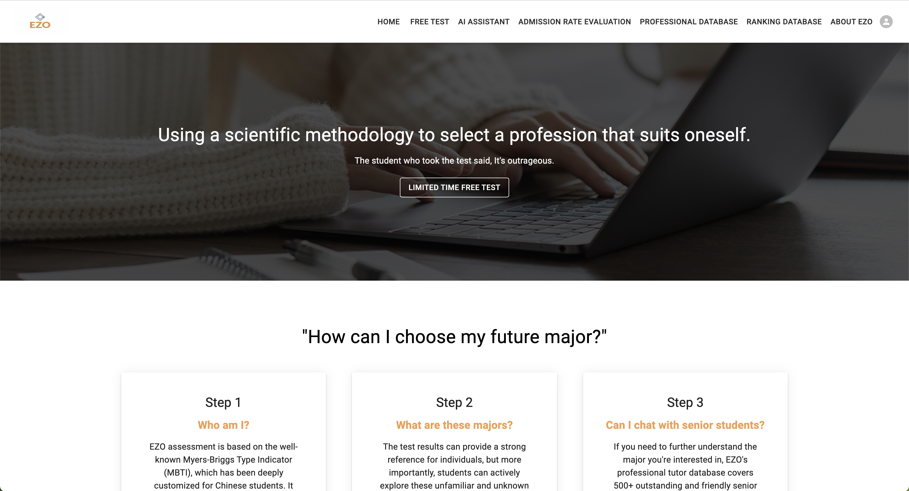
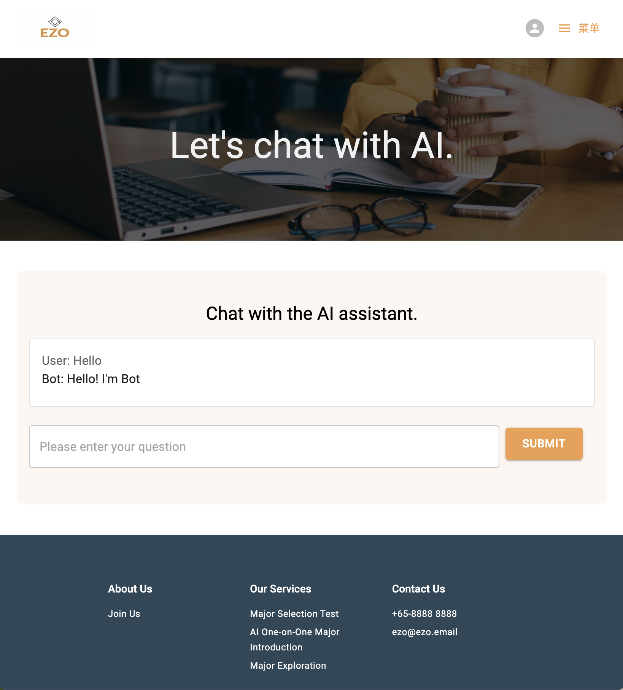
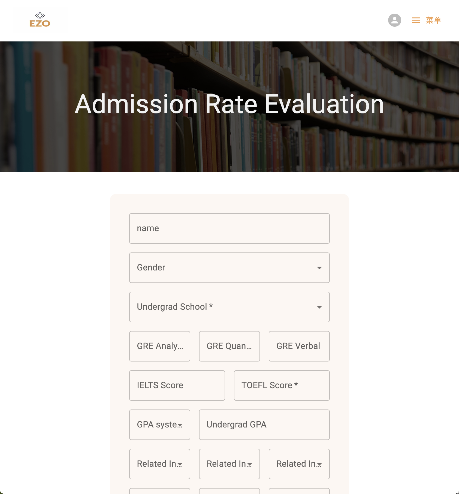

# ISY5001
## SECTION 1 : PROJECT TITLE

### EZOverseas - Q&A and recommendation system for colleges and majors








## SECTION 2 : EXECUTIVE SUMMARY

With globalization, international student mobility has risen sharply. In 2022 alone, over 830,000 Chinese students went abroad for studies. To maximize their chances of admission to their dream schools, prospective students must understand their target institutions and programs.

Our project group built an AI system to advise students exploring overseas studies. We utilized both front-end and back-end technologies, LLM, and Dialogflow to create an intelligent chatbot that answers user questions about schools and programs. It provides details like university profiles, degree requirements, etc. This gives users a comprehensive overview to make informed comparisons.

Additionally, our platform offers a predictive model that estimates users' admission probabilities for specific degrees at particular universities. By inputting academic performance, test scores, research experience, etc., users receive data-driven assessments of their chances. This assists in objective planning of applications.

Beyond advising services, our platform also includes career orientation tests like MBTI and Holland codes. These help users identify suitable areas of study aligned to their personalities.

Through disciplined teamwork, we successfully built an AI system with chatbot services, admission rate predictions and career matching tools. By furnishing insights on universities, programs and admission odds, our platform will aid students in identifying and applying to the most fitting institutions and disciplines. We hope our system will empower aspirants to make informed decisions in pursuing international education.

Our team is composed of five young and passionate Chinese students. In this project, our team went through a cycle of failure, correction, failure again, and correction again, but we did not give up. On the contrary, we became even more united. It was because each and every one of us gave our best effort that we ultimately completed this meaningful project. It not only enhanced our professional abilities but also strengthened our team spirit. I believe that through this project, every member of our team has grown and will undoubtedly create even greater achievements in the future!


## SECTION 3 : CREDITS / PROJECT CONTRIBUTION

| Official Full Name | Student ID (MTech Applicable) | Work Items (Who Did What)      | Email (Optional)   |
| :----------------- | :---------------------------: | :----------------------------- | :----------------- |
| LI YIYAO           |           A0285760W           | Leader<br />Model developement |                    |
| LIANG ZHU          |           A0285771R           | Full-stack development         | e1221583@u.nus.edu |
| SHEN KAIYUAN       |           A0285764M           | Model developement             |                    |
| ZHANG QIYUAN       |           A0285787A           | Model developement             |                    |
| ZHU XUANYA         |           A0285912X           | Model developement             | e1221724@u.nus.edu |


## SECTION 4 : VIDEO OF SYSTEM MODELLING & USE CASE DEMO

Promotion Video:
https://youtu.be/vADeoGBIwN8

Tech Video:
https://www.youtube.com/watch?v=LsC3oUfOusk


## SECTION 5 : USER GUIDE

`Refer to appendix <Installation & User Guide> in project report at Github Folder: ProjectReport`

### To run the frontend system in Docker

#### How to start containers:

1. Clone repositories, run: `git clone git@github.com:Viva-La-Vida2020/ISY5001.git`
2. Install docker: see https://docs.docker.com/get-docker/
3. Go to repo directory(website) and start docker images, run: `docker-compose  -f docker-compose.dev.yml up -V -d --build`
4. Open browser and check out at: http://localhost

#### How to stop containers:

I suggest using docker desktop to stop containers and remove mapped volumes(optional).

#### How to check servicestatus/logs:

Go to docker desktop's correspoding container and inspect.


### To run the backend system

1. Enter the directory: `cd prediction-model`

2. Install required packages: `pip install -r requirements.txt`

3. Configure google-cloud-dialogflow

   Before you set your app default credentials, make sure you're part of a Google clould project. Set the default credential https://cloud.google.com/docs/authentication/provide-credentials-adc?hl=zh-cn#local-dev for the app.

   i.   Install and initialize the gcloud CLI.

   ii.  Create a credential file

   iii. Set the path of the created credential file to an environment variable

4. Configure the local database for the chatbot.

   Modify the configuration in `connect_database()`.

   ```shell
   CREATE DATABASE suitntie;
   USE suitntie;
   source <sql path>
   ```

5. run `python app.py`


## SECTION 6 : PROJECT REPORT

`Refer to project report at Github Folder: ProjectReport`


## SECTION 7 : MISCELLANEOUS

`Refer to Github Folder: Miscellaneous`

**ISY5001-Proposal.pptx**:  A presentation with the background of the project, technical architecture, etc

